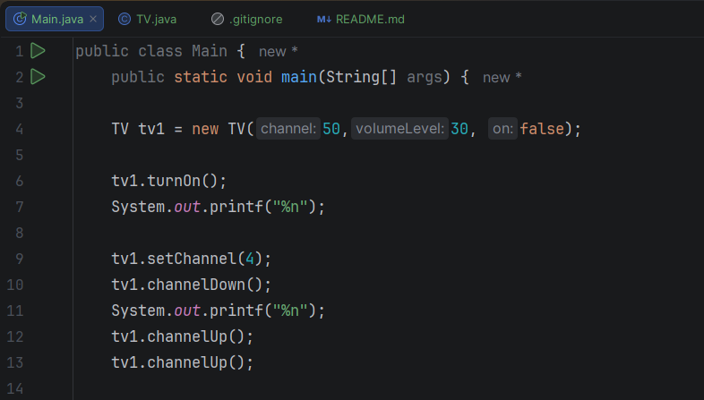
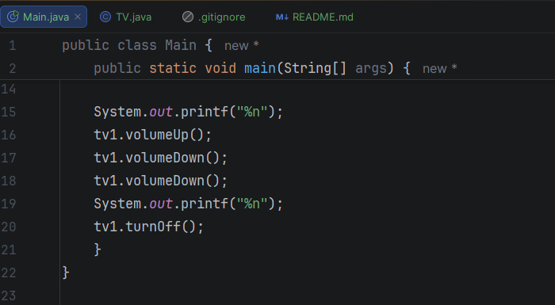
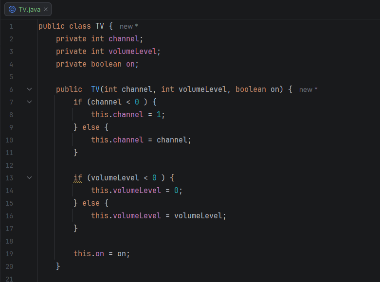
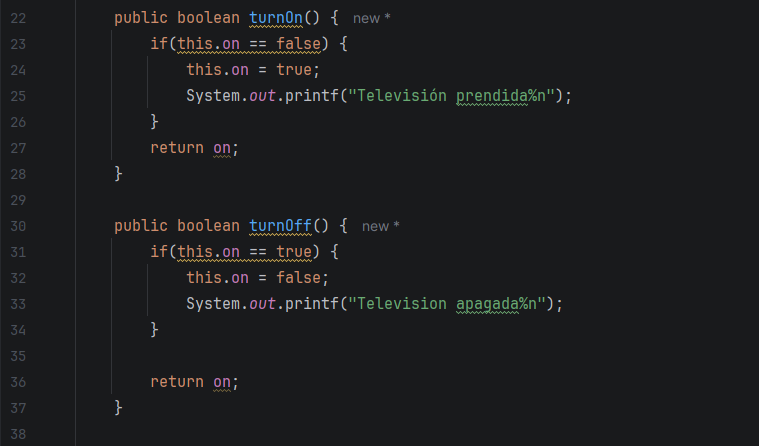
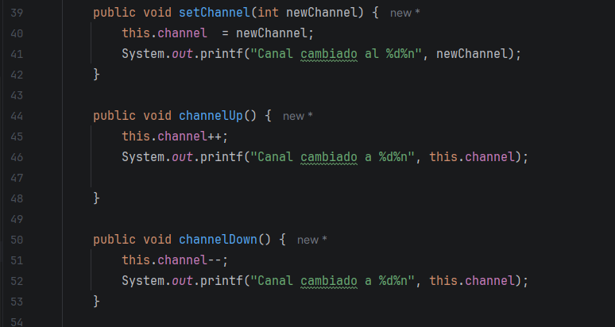
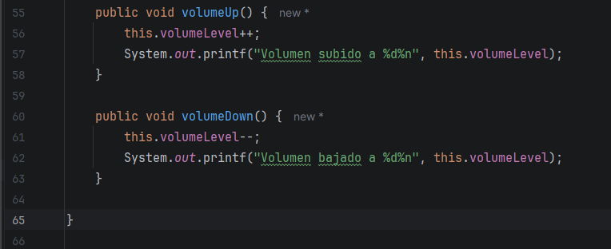
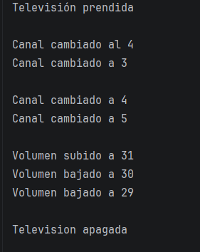

# Actividad 3: TV  

Experiencia educativa: Diseño y programación orientado a objetos  
Alumno: Alan Yahir Tejeda Jiménez  
Matrícula: S25018113  

---
## Evidencia
### Main
- Código Main 

### Clase TV
- Definir atributos y método constructor de la Clase TV

- Códigos de prender y apagar

- Códigos de cambiar canales

- Códigos de volúmen

### Terminal

